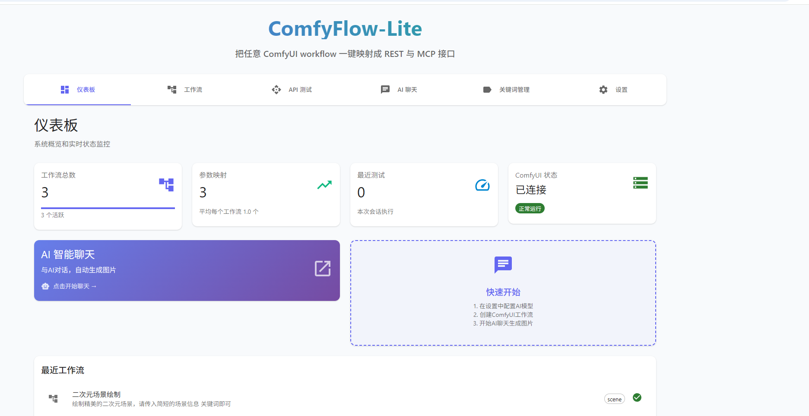

# ComfyFlow-Lite

<div align="center">



> 🎨 **Convert any ComfyUI workflow to REST API and MCP interface with one click**  
> 🚀 **Multi-language interface support** (中文/English/日本語)，**Zero configuration deployment**  
> 🤖 **Perfect support** for Cherry Studio、Claude Desktop and other AI clients

[](https://nodejs.org/)
[](https://nextjs.org/)
[](https://www.typescriptlang.org/)
[](LICENSE)

[🇨🇳 中文](README_zh.md) | [🇺🇸 English](README_en.md) | [🇯🇵 日本語](README_ja.md)

</div>

---

## 🌟 Project Highlights

<div align="center">

### 🎯 **Ultra-Simple Deployment**
No Docker containers or database configuration needed  
Start with `npm install && npm run dev`

### 🔗 **Three Invocation Methods**
REST API + MCP Protocol + GET Requests  
Meet integration needs for different scenarios

### 🎨 **Visual Management**
Modern web interface  
Parameter mapping and keyword library at a glance

### 🤖 **AI Friendly**
Perfect support for Cherry Studio, Claude Desktop  
Generate images through conversation

</div>

---

## 🚀 Quick Start

### Requirements
- Node.js 18+
- Running ComfyUI service (default `http://127.0.0.1:8188`)

### Installation Steps

```bash
# Clone the project
git clone https://github.com/your-username/comfyflow-lite.git
cd comfyflow-lite

# Install dependencies
npm install

# Start development server
npm run dev
```

Visit `http://localhost:3000` to get started

---

## 📖 Choose Language

Please select your preferred language to view detailed documentation:

- [🇨🇳 中文文档](README_zh.md) - Complete Chinese usage guide
- [🇺🇸 English Documentation](README_en.md) - Complete English guide  
- [🇯🇵 日本語ドキュメント](README_ja.md) - Complete Japanese guide

---

<div align="center">

**⭐ If this project is helpful to you, please give it a Star!**

**🌟 Star** • **🍴 Fork** • **📢 Share**

---


**Making ComfyUI workflow API conversion simple and elegant**

Made with ❤️ by the ComfyFlow-Lite team

</div>