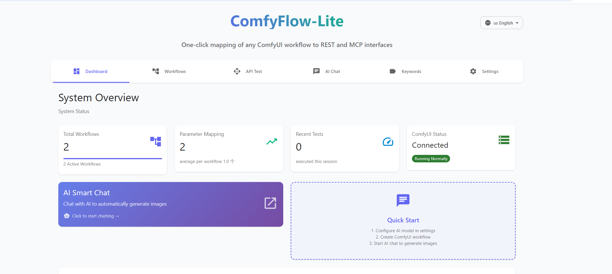
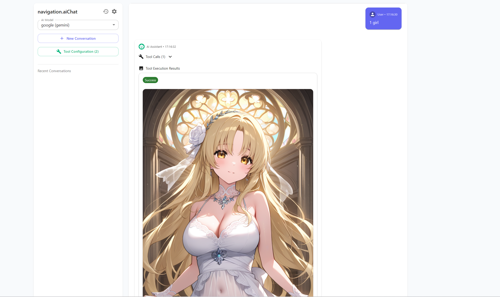

# ComfyFlow-Lite - English Documentation

<div align="center">


> 🎨 **Convert any ComfyUI workflow to REST API and MCP interface with one click**  
> 🚀 **Multi-language interface support**, **Zero configuration deployment**  
> 🤖 **Perfect support** for Cherry Studio, Claude Desktop and other AI clients

[](https://nodejs.org/)
[](https://nextjs.org/)
[](https://www.typescriptlang.org/)
[](LICENSE)

[🏠 Back to Home](README.md) | [🇨🇳 中文](README_zh.md) | [🇯🇵 日本語](README_ja.md)

</div>

---

## ✨ Core Features

- 🎯 **One-Click Deploy**: No Docker or database required, start with npm commands
- 🌍 **Multi-language Support**: Full Chinese/English/Japanese interface localization
- 🔄 **Dual Protocol Support**: Provides both REST API and MCP interfaces
- 🎨 **Visual Management**: Modern web interface for workflow and parameter mapping management
- 🛠️ **Smart Mapping**: Automatic workflow parameter analysis with keyword library support
- 🤖 **AI Friendly**: Perfect support for various MCP clients
- 🚀 **GET Request Support**: Simple URL GET requests for direct image generation

## 📸 Interface Preview

### Main Dashboard
<div align="center">
  
  <p><em>Real-time system status, workflow statistics, and quick action entries</em></p>
</div>

### AI Smart Chat
<div align="center">
  
  <p><em>Chat with AI to automatically invoke workflows for image generation</em></p>
</div>

### System Settings
<div align="center">
  
  <p><em>AI configuration management and system settings</em></p>
</div>

## 🚀 Quick Start

### Requirements
- Node.js 18+
- Running ComfyUI service (default `http://127.0.0.1:8188`)

### Installation

```bash
# Clone the project
git clone https://github.com/your-username/comfyflow-lite.git
cd comfyflow-lite

# Install dependencies
npm install

# Start development server
npm run dev
```

Visit `http://localhost:3000` to get started

## 🔧 Configuration

### Environment Variables

Create `.env.local` file:

```bash
# ComfyUI server address
COMFYUI_URL=http://127.0.0.1:8188

# API authentication token (optional)
AUTH_TOKEN=your-secret-token

# Service port (optional, default 3000)
PORT=3000
```

## 📖 Usage Guide

1. **Configure AI Models**: Add OpenAI, Anthropic, and other AI service configurations in settings
2. **Upload Workflows**: Upload ComfyUI JSON workflow files in workflow management
3. **Parameter Mapping**: Configure parameters to expose (prompts, seeds, steps, etc.)
4. **AI Chat**: Chat with AI to automatically generate images
5. **API Calls**: Invoke workflows via REST or MCP protocols

## 🔗 API Usage Examples

### REST API

```bash
# POST request
curl -X POST http://localhost:3000/api/generate/your_endpoint \
  -H "Content-Type: application/json" \
  -d '{"prompt": "a beautiful landscape"}'

# GET request (unique feature)
curl "http://localhost:3000/api/generate/your_endpoint?prompt=beautiful%20landscape"
```

### MCP Protocol

```bash
curl -X POST http://localhost:3000/api/mcp \
  -H "Content-Type: application/json" \
  -d '{
    "jsonrpc":"2.0",
    "method":"tools/call",
    "params":{
      "name":"generateYourEndpoint",
      "arguments":{"prompt":"a beautiful landscape"}
    },
    "id":1
  }'
```

## 🆚 Comparison with Pixelle MCP

Compared to the [Pixelle MCP](https://github.com/AIDC-AI/Pixelle-MCP) project, ComfyFlow-Lite is more **simple and practical**:

| Feature | ComfyFlow-Lite | Pixelle MCP |
|---------|----------------|-------------|
| **Deployment Complexity** | ⭐⭐⭐⭐⭐ Ultra-simple | ⭐⭐⭐ Medium |
| **Tech Stack** | Pure JavaScript (Node.js) | Python + multiple dependencies |
| **Installation** | `npm install` one-step | Requires Python environment + pip/uvx |
| **Configuration** | 🎯 Web interface visual config | 📝 Manual config file editing |
| **Invocation Methods** | 🔗 REST + MCP + **GET requests** | 🔌 MCP protocol only |
| **Parameter Mapping** | 🛠️ Auto-analysis + visual config | 📋 Manual node title editing |
| **Keyword Library** | ✅ Built-in keyword management | ❌ Not supported |
| **Database** | 🗃️ Built-in SQLite, zero-config | 📁 File system storage |
| **Web Interface** | 🎨 Professional workflow management | 💬 Chainlit-based chat interface |

### 🚀 Unique Advantages of ComfyFlow-Lite

1. **🎯 Simpler Deployment**
   ```bash
   # ComfyFlow-Lite - 3 steps to start
   git clone && npm install && npm run dev
   ```

2. **🔗 More Flexible Invocation Methods**
   ```bash
   # Support simple GET requests
   curl "http://localhost:3000/api/generate/your_endpoint?prompt=cute%20cat"

   # Traditional POST request
   curl -X POST http://localhost:3000/api/generate/your_endpoint \
     -d '{"prompt": "cute cat"}'

   # MCP protocol calls
   # Fully MCP standard compliant
   ```

3. **🛠️ More Intuitive Configuration Experience**
   - **ComfyFlow-Lite**: Web interface click configuration, WYSIWYG
   - **Pixelle MCP**: Manual node title editing with special syntax

4. **📊 More Complete Data Management**
   - Built-in keyword library system supporting character, style, action categories
   - SQLite database storage supporting complex queries and data relationships
   - CSV batch import support for keywords

**💡 Selection Recommendations**:
- 🎯 **Pursue simplicity**: Choose ComfyFlow-Lite
- 🔬 **Need complex customization**: Consider Pixelle MCP
- 🚀 **Rapid prototyping**: ComfyFlow-Lite is more suitable

## 📖 Detailed Usage Guide

### 1. Configure ComfyUI Connection

If ComfyUI is not at the default address, create `.env.local` file:

```bash
COMFYUI_URL=http://your-comfyui-address:port
```

### 2. Upload Workflows

<div align="center">
  
</div>

1. Visit `http://localhost:3000/workflow-admin`
2. Click "➕ Create Workflow"
3. Upload ComfyUI `workflow.json` file
4. Set workflow name and API endpoint name

### 3. Configure Parameter Mapping

1. System automatically analyzes workflow parameters
2. Select parameters to expose (prompts, seeds, steps, etc.)
3. Set parameter names, types, default values
4. Optional: Configure keyword library references

### 4. Manage Keyword Library

- Support for character, action, style keyword categories
- Batch CSV import or manual creation
- Consistency control through `key` parameter

## 🔗 Detailed API Calls

### REST API Calls

<div align="center">
  
</div>

```bash
# POST request (full functionality)
curl -X POST http://localhost:3000/api/generate/your_endpoint \
  -H "Content-Type: application/json" \
  -d '{"prompt": "a beautiful landscape", "key": "style001"}'

# GET request (super simple!) - Unique feature 🚀
curl "http://localhost:3000/api/generate/your_endpoint?prompt=a%20beautiful%20landscape"

# Direct browser access
http://localhost:3000/api/generate/your_endpoint?prompt=cute%20cat&key=girl001
```

> 💡 **GET Request Advantages**: Unlike Pixelle MCP which only supports complex MCP calls, our GET requests make API calls extremely simple!
> - 🌐 **Browser-friendly**: Generate images directly in browser address bar
> - 🔗 **URL Sharing**: Can directly share URLs for others to use
> - 📱 **Mobile-friendly**: Easy to call from mobile browsers
> - 🛠️ **Easy Debugging**: Test with URLs, no POST tools needed

### MCP Interface Calls

```bash
# Get server information
curl http://localhost:3000/api/mcp

# List all tools
curl -X POST http://localhost:3000/api/mcp \
  -H "Content-Type: application/json" \
  -d '{"jsonrpc":"2.0","method":"tools/list","id":1}'

# Call tool to generate image
curl -X POST http://localhost:3000/api/mcp \
  -H "Content-Type: application/json" \
  -d '{
    "jsonrpc":"2.0",
    "method":"tools/call",
    "params":{
      "name":"generateYourEndpoint",
      "arguments":{"prompt":"a beautiful landscape"}
    },
    "id":1
  }'
```

## 🤖 AI Client Configuration

### Cherry Studio Configuration

<div align="center">
  
</div>

1. Open Cherry Studio settings
2. Add MCP server configuration:

```json
"mcpServers": {
  "comfyui-workflow": {
    "name": "images",
    "type": "streamableHttp",
    "description": "Collection of tools for generating images/videos",
    "isActive": true,
    "baseUrl": "http://127.0.0.1:3000/api/mcp"
  }
}
```

3. Restart Cherry Studio
4. Use image generation in conversations

### Claude Desktop Configuration

Edit Claude Desktop configuration file:

**Windows**: `%APPDATA%\Claude\claude_desktop_config.json`
**macOS**: `~/Library/Application Support/Claude/claude_desktop_config.json`

```json
{
  "mcpServers": {
    "comfyui-workflow": {
      "command": "node",
      "args": [
        "-e",
        "const http = require('http'); const options = { hostname: '127.0.0.1', port: 3000, path: '/api/mcp', method: 'POST', headers: { 'Content-Type': 'application/json' } }; process.stdin.pipe(http.request(options, res => res.pipe(process.stdout)));"
      ]
    }
  }
}
```

## ⚙️ Configuration Options

### Environment Variables

```bash
# ComfyUI server address
COMFYUI_URL=http://127.0.0.1:8188

# API authentication token (optional)
AUTH_TOKEN=your-secret-token

# Service port (optional, default 3000)
PORT=3000
```

### Management Interfaces

- **Workflow Management**: `http://localhost:3000/workflow-admin`
- **Keyword Management**: `http://localhost:3000/keyword-admin`
- **API Testing**: `http://localhost:3000`

## 🐛 Common Issues

**Q: Cannot connect to ComfyUI**
- Ensure ComfyUI is running
- Check `COMFYUI_URL` configuration in `.env.local`
- Verify firewall settings

**Q: Workflow execution failed**
- Check if ComfyUI has required custom nodes installed
- Ensure model file paths are correct
- Check ComfyUI console error messages

**Q: MCP call failed**
- Ensure correct JSON-RPC 2.0 format is used
- Check if tool name is correct
- Verify parameter format

## 🛠️ Development Examples

### JavaScript Example

```javascript
// GET method call (supports caching)
async function generateImageGET(endpoint, params, useCache = true) {
  const searchParams = new URLSearchParams(params);
  if (!useCache) {
    searchParams.set('force_regenerate', 'true');
  }
  searchParams.set('format', 'json'); // Get JSON data

  const response = await fetch(`http://127.0.0.1:3000/api/generate/${endpoint}?${searchParams}`);
  const result = await response.json();

  if (result.success) {
    console.log(`Image generation successful (cached: ${result.data.cached}):`, result.data.url);
    return result.data;
  } else {
    throw new Error(result.error);
  }
}

// POST method call
async function generateImagePOST(endpoint, params, useCache = true) {
  const body = { ...params };
  if (!useCache) {
    body.force_regenerate = true;
  }

  const response = await fetch(`http://127.0.0.1:3000/api/generate/${endpoint}`, {
    method: 'POST',
    headers: { 'Content-Type': 'application/json' },
    body: JSON.stringify(body)
  });

  const result = await response.json();
  if (result.success) {
    console.log(`Image generation successful (cached: ${result.data.cached}):`, result.data.url);
    return result.data;
  } else {
    throw new Error(result.error);
  }
}

// Direct image display (GET method default behavior)
function showImageDirect(endpoint, params) {
  const searchParams = new URLSearchParams(params);
  const img = document.createElement('img');
  img.src = `http://127.0.0.1:3000/api/generate/${endpoint}?${searchParams}`;
  img.alt = 'Generated Image';
  img.style.maxWidth = '100%';
  document.body.appendChild(img);
}
```

### Python Example

```python
import requests

def generate_image(endpoint, params):
    url = f"http://127.0.0.1:3000/api/generate/{endpoint}"
    response = requests.post(url, json=params)
    
    result = response.json()
    if result['success']:
        print(f"Image generation successful: {result['data']['url']}")
        return result['data']
    else:
        raise Exception(result['error'])

# Usage example
try:
    data = generate_image('your_endpoint', {'prompt': 'your prompt'})
    print(data)
except Exception as e:
    print(f"Error: {e}")
```

## 🤝 Contributing

We welcome contributions in all forms! Whether reporting bugs, suggesting new features, or submitting code improvements.

### How to Contribute

1. Fork the project
2. Create feature branch: `git checkout -b feature/amazing-feature`
3. Commit changes: `git commit -m 'Add some amazing feature'`
4. Push branch: `git push origin feature/amazing-feature`
5. Submit Pull Request

### Development Environment Setup

```bash
# Clone your fork
git clone https://github.com/your-username/comfyflow-lite.git
cd comfyflow-lite

# Install dependencies
npm install

# Start development server
npm run dev

# Run tests
npm run test

# Check code style
npm run lint
```

### Reporting Issues

If you find a bug or have feature suggestions, please create a new issue in [GitHub Issues](https://github.com/your-username/comfyflow-lite/issues).

## 📄 License

This project is licensed under the MIT License - see the [LICENSE](LICENSE) file for details

```
MIT License

Copyright (c) 2024 ComfyFlow-Lite

Permission is hereby granted, free of charge, to any person obtaining a copy
of this software and associated documentation files (the "Software"), to deal
in the Software without restriction, including without limitation the rights
to use, copy, modify, merge, publish, distribute, sublicense, and/or sell
copies of the Software, and to permit persons to whom the Software is
furnished to do so, subject to the following conditions:

The above copyright notice and this permission notice shall be included in all
copies or substantial portions of the Software.
```

## 🙏 Acknowledgments

Special thanks to the following open source projects and communities:

- **[ComfyUI](https://github.com/comfyanonymous/ComfyUI)** - Powerful AI image generation tool
- **[Next.js](https://nextjs.org/)** - Excellent full-stack React framework
- **[MCP](https://modelcontextprotocol.io/)** - Model Context Protocol standard
- **[Material-UI](https://mui.com/)** - Modern React UI component library
- **[SQLite](https://www.sqlite.org/)** - Lightweight database engine
- **[TypeScript](https://www.typescriptlang.org/)** - Type-safe superset of JavaScript

Thanks to all contributors and users for their support!

## 📞 Support & Community

### Getting Help

- 📖 **Documentation**: Detailed [API Usage Documentation](API_USAGE.md)
- 🐛 **Bug Reports**: [GitHub Issues](https://github.com/your-username/comfyflow-lite/issues)
- 💡 **Feature Suggestions**: [GitHub Discussions](https://github.com/your-username/comfyflow-lite/discussions)
- 📧 **Contact Us**: [your-email@example.com](mailto:your-email@example.com)

### Quick Links

- 🏠 **Homepage**: `http://localhost:3000`
- ⚙️ **Workflow Management**: `http://localhost:3000/workflow-admin`
- 🏷️ **Keyword Management**: `http://localhost:3000/keyword-admin`
- 📊 **API Testing**: Built-in testing tools
- 📝 **API Documentation**: [API_USAGE.md](API_USAGE.md)

---

<div align="center">

**⭐ If this project is helpful to you, please give it a Star!**

**🌟 Star** • **🍴 Fork** • **📢 Share**

---


**Making ComfyUI workflow API conversion simple and elegant**

Made with ❤️ by the ComfyFlow-Lite team

</div>