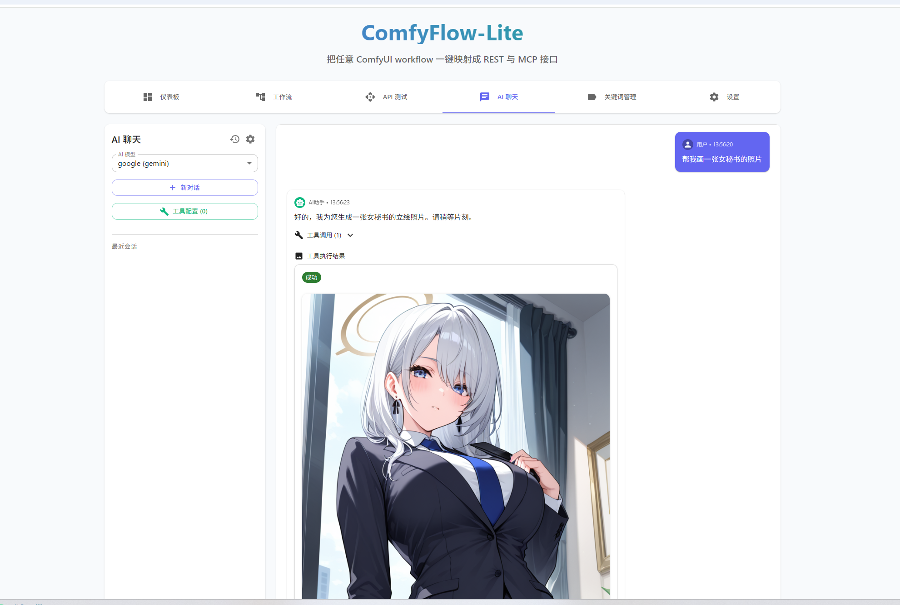
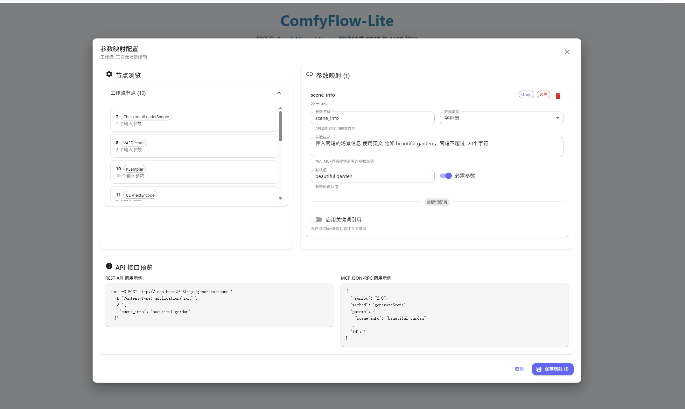

# ComfyFlow-Lite - 中文文档

<div align="center">


> 🎨 **一键将任意 ComfyUI 工作流转换为 REST API 和 MCP 接口**  
> 🚀 **支持多语言界面**，**零配置部署**  
> 🤖 **完美支持** Cherry Studio、Claude Desktop 等 AI 客户端

[](https://nodejs.org/)
[](https://nextjs.org/)
[](https://www.typescriptlang.org/)
[](LICENSE)

[🏠 返回主页](README.md) | [🇺🇸 English](README_en.md) | [🇯🇵 日本語](README_ja.md)

</div>

---

## ✨ 核心功能

- 🎯 **一键部署**：无需 Docker、数据库，npm 命令即可启动
- 🌍 **多语言支持**：完整的中英日界面本地化
- 🔄 **双协议支持**：同时提供 REST API 和 MCP 接口
- 🎨 **可视化管理**：现代化 Web 界面管理工作流和参数映射
- 🛠️ **智能映射**：自动分析工作流参数，支持关键词库
- 🤖 **AI 友好**：完美支持各种 MCP 客户端
- 🚀 **GET 请求支持**：支持简单的 URL GET 请求直接生成图片

## 📸 界面预览

### 主界面 - 仪表板
<div align="center">
  
  <p><em>实时显示系统状态、工作流统计和快速操作入口</em></p>
</div>

### AI 智能聊天
<div align="center">
  
  <p><em>与 AI 对话，自动调用工作流生成图片</em></p>
</div>

### 系统设置
<div align="center">
  
  <p><em>AI 配置管理和系统设置</em></p>
</div>

## 🚀 快速开始

### 环境要求
- Node.js 18+
- 运行中的 ComfyUI 服务 (默认 `http://127.0.0.1:8188`)

### 安装步骤

```bash
# 克隆项目
git clone https://github.com/your-username/comfyflow-lite.git
cd comfyflow-lite

# 安装依赖
npm install

# 启动开发服务器
npm run dev
```

访问 `http://localhost:3000` 开始使用

## 🔧 配置说明

### 环境变量配置

创建 `.env.local` 文件：

```bash
# ComfyUI 服务器地址
COMFYUI_URL=http://127.0.0.1:8188

# API 认证令牌（可选）
AUTH_TOKEN=your-secret-token

# 服务端口（可选，默认 3000）
PORT=3000
```

## 📖 使用指南

1. **配置 AI 模型**：在设置页面添加 OpenAI、Anthropic 等 AI 服务配置
2. **上传工作流**：在工作流管理页面上传 ComfyUI 的 JSON 工作流文件
3. **参数映射**：配置需要暴露的参数（提示词、种子、步数等）
4. **AI 聊天**：与 AI 对话自动生成图片
5. **API 调用**：通过 REST 或 MCP 协议调用工作流

## 🔗 API 调用示例

### REST API

```bash
# POST 请求
curl -X POST http://localhost:3000/api/generate/your_endpoint \
  -H "Content-Type: application/json" \
  -d '{"prompt": "a beautiful landscape"}'

# GET 请求（独有特性）
curl "http://localhost:3000/api/generate/your_endpoint?prompt=beautiful%20landscape"
```

### MCP 协议

```bash
curl -X POST http://localhost:3000/api/mcp \
  -H "Content-Type: application/json" \
  -d '{
    "jsonrpc":"2.0",
    "method":"tools/call",
    "params":{
      "name":"generateYourEndpoint",
      "arguments":{"prompt":"a beautiful landscape"}
    },
    "id":1
  }'
```

## 🆚 与 Pixelle MCP 对比

相比 [Pixelle MCP](https://github.com/AIDC-AI/Pixelle-MCP) 项目，ComfyFlow-Lite 更加**简洁实用**：

| 特性 | ComfyFlow-Lite | Pixelle MCP |
|------|----------------|-------------|
| **部署复杂度** | ⭐⭐⭐⭐⭐ 极简 | ⭐⭐⭐ 中等 |
| **技术栈** | 纯 JavaScript (Node.js) | Python + 多个依赖 |
| **安装方式** | `npm install` 一步到位 | 需要 Python 环境 + pip/uvx |
| **配置难度** | 🎯 Web 界面可视化配置 | 📝 需要编辑配置文件 |
| **调用方式** | 🔗 REST + MCP + **GET 请求** | 🔌 仅 MCP 协议 |
| **参数映射** | 🛠️ 自动分析 + 可视化配置 | 📋 手动编辑节点标题 |
| **关键词库** | ✅ 内置关键词管理系统 | ❌ 不支持 |
| **数据库** | 🗃️ 内置 SQLite，零配置 | 📁 文件系统存储 |
| **Web 界面** | 🎨 专业的工作流管理界面 | 💬 基于 Chainlit 的聊天界面 |

### 🚀 ComfyFlow-Lite 的独特优势

1. **🎯 更简单的部署**
   ```bash
   # ComfyFlow-Lite - 3步启动
   git clone && npm install && npm run dev
   ```

2. **🔗 更灵活的调用方式**
   ```bash
   # 支持简单的 GET 请求
   curl "http://localhost:3000/api/generate/your_endpoint?prompt=cute%20cat"

   # 传统 POST 请求
   curl -X POST http://localhost:3000/api/generate/your_endpoint \
     -d '{"prompt": "cute cat"}'

   # MCP 协议调用
   # 完全兼容 MCP 标准
   ```

3. **🛠️ 更直观的配置体验**
   - **ComfyFlow-Lite**: Web 界面点击配置，所见即所得
   - **Pixelle MCP**: 需要手动编辑节点标题，使用特殊语法

4. **📊 更完善的数据管理**
   - 内置关键词库系统，支持人物、风格、动作等分类
   - SQLite 数据库存储，支持复杂查询和数据关系
   - 支持 CSV 批量导入关键词

**💡 选择建议**：
- 🎯 **追求简单易用**：选择 ComfyFlow-Lite
- 🔬 **需要复杂定制**：可考虑 Pixelle MCP
- 🚀 **快速原型开发**：ComfyFlow-Lite 更适合

## 📖 详细使用指南

### 1. 配置 ComfyUI 连接

如果 ComfyUI 不在默认地址，创建 `.env.local` 文件：

```bash
COMFYUI_URL=http://your-comfyui-address:port
```

### 2. 上传工作流

<div align="center">
  
</div>

1. 访问 `http://localhost:3000/workflow-admin`
2. 点击「➕ 创建工作流」
3. 上传 ComfyUI 的 `workflow.json` 文件
4. 设置工作流名称和 API 端点名称

### 3. 配置参数映射

1. 系统自动分析工作流参数
2. 选择需要暴露的参数（提示词、种子、步数等）
3. 设置参数名称、类型、默认值
4. 可选：配置关键词库引用

### 4. 管理关键词库

- 支持人物、动作、风格等关键词分类
- 批量 CSV 导入或手动创建
- 通过 `key` 参数实现一致性控制

## 🔗 API 调用详解

### REST API 调用

<div align="center">
  
</div>

```bash
# POST 请求（完整功能）
curl -X POST http://localhost:3000/api/generate/your_endpoint \
  -H "Content-Type: application/json" \
  -d '{"prompt": "a beautiful landscape", "key": "style001"}'

# GET 请求（超简单！）- 独有特性 🚀
curl "http://localhost:3000/api/generate/your_endpoint?prompt=a%20beautiful%20landscape"

# 浏览器直接访问
http://localhost:3000/api/generate/your_endpoint?prompt=cute%20cat&key=girl001
```

> 💡 **GET 请求优势**：相比 Pixelle MCP 只支持复杂的 MCP 调用，我们的 GET 请求让 API 调用变得极其简单！
> - 🌐 **浏览器友好**：直接在浏览器地址栏输入即可生成图片
> - 🔗 **URL 分享**：可以直接分享 URL 给他人使用
> - 📱 **移动端友好**：手机浏览器也能轻松调用
> - 🛠️ **调试简单**：无需 POST 工具，URL 即可测试

### MCP 接口调用

```bash
# 获取服务器信息
curl http://localhost:3000/api/mcp

# 列出所有工具
curl -X POST http://localhost:3000/api/mcp \
  -H "Content-Type: application/json" \
  -d '{"jsonrpc":"2.0","method":"tools/list","id":1}'

# 调用工具生成图片
curl -X POST http://localhost:3000/api/mcp \
  -H "Content-Type: application/json" \
  -d '{
    "jsonrpc":"2.0",
    "method":"tools/call",
    "params":{
      "name":"generateYourEndpoint",
      "arguments":{"prompt":"a beautiful landscape"}
    },
    "id":1
  }'
```

## 🤖 AI 客户端配置

### Cherry Studio 配置

<div align="center">
  
</div>

1. 打开 Cherry Studio 设置
2. 添加 MCP 服务器配置：

```json
"mcpServers": {
  "comfyui-workflow": {
    "name": "images",
    "type": "streamableHttp",
    "description": "生成图片/视频的工具合辑",
    "isActive": true,
    "baseUrl": "http://127.0.0.1:3000/api/mcp"
  }
}
```

3. 重启 Cherry Studio
4. 在对话中使用图片生成功能

### Claude Desktop 配置

编辑 Claude Desktop 配置文件：

**Windows**: `%APPDATA%\Claude\claude_desktop_config.json`
**macOS**: `~/Library/Application Support/Claude/claude_desktop_config.json`

```json
{
  "mcpServers": {
    "comfyui-workflow": {
      "command": "node",
      "args": [
        "-e",
        "const http = require('http'); const options = { hostname: '127.0.0.1', port: 3000, path: '/api/mcp', method: 'POST', headers: { 'Content-Type': 'application/json' } }; process.stdin.pipe(http.request(options, res => res.pipe(process.stdout)));"
      ]
    }
  }
}
```

## ⚙️ 配置选项

### 环境变量

```bash
# ComfyUI 服务器地址
COMFYUI_URL=http://127.0.0.1:8188

# API 认证令牌（可选）
AUTH_TOKEN=your-secret-token

# 服务端口（可选，默认 3000）
PORT=3000
```

### 管理界面

- **工作流管理**: `http://localhost:3000/workflow-admin`
- **关键词管理**: `http://localhost:3000/keyword-admin`
- **API 测试**: `http://localhost:3000`

## 🐛 常见问题

**Q: 无法连接到 ComfyUI**
- 确保 ComfyUI 正在运行
- 检查 `.env.local` 中的 `COMFYUI_URL` 配置
- 验证防火墙设置

**Q: 工作流执行失败**
- 检查 ComfyUI 是否安装了所需的自定义节点
- 确保模型文件路径正确
- 查看 ComfyUI 控制台错误信息

**Q: MCP 调用失败**
- 确保使用正确的 JSON-RPC 2.0 格式
- 检查工具名称是否正确
- 验证参数格式

## 🛠️ 开发示例

### JavaScript 示例

```javascript
// GET方法调用（支持缓存）
async function generateImageGET(endpoint, params, useCache = true) {
  const searchParams = new URLSearchParams(params);
  if (!useCache) {
    searchParams.set('force_regenerate', 'true');
  }
  searchParams.set('format', 'json'); // 获取JSON数据

  const response = await fetch(`http://127.0.0.1:3000/api/generate/${endpoint}?${searchParams}`);
  const result = await response.json();

  if (result.success) {
    console.log(`图片生成成功 (缓存: ${result.data.cached}):`, result.data.url);
    return result.data;
  } else {
    throw new Error(result.error);
  }
}

// POST方法调用
async function generateImagePOST(endpoint, params, useCache = true) {
  const body = { ...params };
  if (!useCache) {
    body.force_regenerate = true;
  }

  const response = await fetch(`http://127.0.0.1:3000/api/generate/${endpoint}`, {
    method: 'POST',
    headers: { 'Content-Type': 'application/json' },
    body: JSON.stringify(body)
  });

  const result = await response.json();
  if (result.success) {
    console.log(`图片生成成功 (缓存: ${result.data.cached}):`, result.data.url);
    return result.data;
  } else {
    throw new Error(result.error);
  }
}

// 直接显示图片（GET方法默认行为）
function showImageDirect(endpoint, params) {
  const searchParams = new URLSearchParams(params);
  const img = document.createElement('img');
  img.src = `http://127.0.0.1:3000/api/generate/${endpoint}?${searchParams}`;
  img.alt = 'Generated Image';
  img.style.maxWidth = '100%';
  document.body.appendChild(img);
}
```

### Python 示例

```python
import requests

def generate_image(endpoint, params):
    url = f"http://127.0.0.1:3000/api/generate/{endpoint}"
    response = requests.post(url, json=params)
    
    result = response.json()
    if result['success']:
        print(f"图片生成成功: {result['data']['url']}")
        return result['data']
    else:
        raise Exception(result['error'])

# 使用示例
try:
    data = generate_image('your_endpoint', {'prompt': 'your prompt'})
    print(data)
except Exception as e:
    print(f"错误: {e}")
```

## 🤝 贡献

我们欢迎各种形式的贡献！无论是报告错误、提出新功能还是提交代码改进。

### 如何贡献

1. Fork 项目
2. 创建特性分支: `git checkout -b feature/amazing-feature`
3. 提交更改: `git commit -m 'Add some amazing feature'`
4. 推送分支: `git push origin feature/amazing-feature`
5. 提交 Pull Request

### 开发环境设置

```bash
# 克隆您的 fork
git clone https://github.com/your-username/comfyflow-lite.git
cd comfyflow-lite

# 安装依赖
npm install

# 启动开发服务器
npm run dev

# 运行测试
npm run test

# 检查代码风格
npm run lint
```

### 报告问题

如果您发现了错误或有功能建议，请在 [GitHub Issues](https://github.com/your-username/comfyflow-lite/issues) 中创建一个新的 issue。

## 📄 许可证

本项目采用 MIT 许可证 - 详见 [LICENSE](LICENSE) 文件

```
MIT License

Copyright (c) 2024 ComfyFlow-Lite

Permission is hereby granted, free of charge, to any person obtaining a copy
of this software and associated documentation files (the "Software"), to deal
in the Software without restriction, including without limitation the rights
to use, copy, modify, merge, publish, distribute, sublicense, and/or sell
copies of the Software, and to permit persons to whom the Software is
furnished to do so, subject to the following conditions:

The above copyright notice and this permission notice shall be included in all
copies or substantial portions of the Software.
```

## 🙏 致谢

特别感谢以下开源项目和社区：

- **[ComfyUI](https://github.com/comfyanonymous/ComfyUI)** - 强大的 AI 图像生成工具
- **[Next.js](https://nextjs.org/)** - 优秀的全栈 React 框架
- **[MCP](https://modelcontextprotocol.io/)** - 模型上下文协议标准
- **[Material-UI](https://mui.com/)** - 现代化的 React UI 组件库
- **[SQLite](https://www.sqlite.org/)** - 轻量级数据库引擎
- **[TypeScript](https://www.typescriptlang.org/)** - JavaScript 的类型安全超集

感谢所有贡献者和使用者的支持！

## 📞 支持与社区

### 获取帮助

- 📖 **文档**: 详细的 [API 使用文档](API_USAGE.md)
- 🐛 **Bug 报告**: [GitHub Issues](https://github.com/your-username/comfyflow-lite/issues)
- 💡 **功能建议**: [GitHub Discussions](https://github.com/your-username/comfyflow-lite/discussions)
- 📧 **联系我们**: [your-email@example.com](mailto:your-email@example.com)

### 快速链接

- 🏠 **主页**: `http://localhost:3000`
- ⚙️ **工作流管理**: `http://localhost:3000/workflow-admin`
- 🏷️ **关键词管理**: `http://localhost:3000/keyword-admin`
- 📊 **API 测试**: 内置测试工具
- 📝 **API 文档**: [API_USAGE.md](API_USAGE.md)

---

<div align="center">

**⭐ 如果这个项目对您有帮助，请给个 Star！**

**🌟 Star** • **🍴 Fork** • **📢 Share**

---


**让 ComfyUI 工作流的 API 化变得简单而优雅**

Made with ❤️ by the ComfyFlow-Lite team

</div>